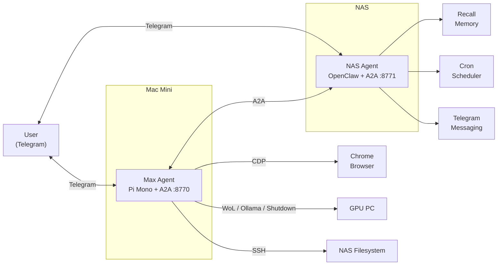

# Agent Max

A self-hosted autonomous agent that runs on a Mac Mini, designed to work as part of a distributed multi-agent system. Max handles browser automation, GPU management, file operations, and delegates tasks to a companion NAS agent via the A2A (Agent-to-Agent) protocol.

## Architecture

Max runs on a Mac Mini alongside a companion agent (Nix) on a NAS. Both expose A2A servers and communicate bidirectionally. Users interact with both agents through Telegram.



## Tools

| Tool | Description |
|------|-------------|
| `browser_control` | Chrome automation via CDP |
| `wake_gpu` / `shutdown_gpu` / `gpu_status` | GPU PC power management (WoL + Ollama) |
| `ssh_to_nas` | Run commands on the NAS via SSH |
| `delegate_to_nix` | Send tasks to the NAS agent via A2A |
| `read_file` / `write_file` / `list_files` | Local filesystem operations |
| `run_shell` | Execute shell commands |
| `delegate_to_claude_subagent` | Launch Claude Code subagent jobs asynchronously with AgentWeave attribution |
| `linkedin_search` / `linkedin_results` | LinkedIn scraping |
| `launchpad_run_scraper` / `launchpad_deploy` | Launchpad automation |
| `ios_list_devices` / `ios_build` / `ios_install` | iOS build and deploy |
| `context_info` | Agent context and state info |

## Setup

```bash
git clone <repo-url> && cd agent-max
cp .env.example .env
# Fill in your API keys and config in .env
npm install
npm run build
npm start
```

### Environment Variables

See `.env.example` for the full list. Key variables:

- `GOOGLE_API_KEY` / `ANTHROPIC_API_KEY` — LLM provider keys (used for direct provider mode)
- `MUX_ENABLED` / `MUX_BASE_URL` / `MUX_API_KEY` — route Max through Mux via an OpenAI-compatible endpoint while preserving the requested model name
- `CLAUDE_SUBAGENT_MODEL` — Claude model used by `delegate_to_claude_subagent` (default: `claude-sonnet-4-6`)
- `TELEGRAM_BOT_TOKEN` / `TELEGRAM_ALLOWED_USERS` — Telegram bot config
- `A2A_PORT` — Port for the A2A server (default: 8770)
- `A2A_SHARED_SECRET` — Shared secret for A2A auth between agents
- `NIX_A2A_URL` — URL of the companion NAS agent
- `NAS_HOST` / `NAS_USER` — NAS SSH access
- `GPU_HOST` / `GPU_WOL_URL` / `GPU_SHUTDOWN_TOKEN` — GPU PC management
- `MAX_A2A_URL` — Public URL for this agent's A2A card

### Mux integration

Set these in `.env` to route Max through Mux:

```bash
MUX_ENABLED=true
MUX_BASE_URL=http://<mux-host>:8787/v1
# optional if Mux later requires auth
MUX_API_KEY=
# requested model name Max will send to Mux
DEFAULT_MODEL=claude-sonnet-4-6
```

When Mux is enabled, Max switches to the OpenAI-compatible transport internally, keeps the requested model id (for example `claude-sonnet-4-6`), and adds `X-Runtime: agent-max` on requests so Mux can attribute routing decisions by runtime.

### Claude Code subagent delegation

`delegate_to_claude_subagent` runs Claude Code in a background process so Max can stay responsive.

- `action=start` launches a job and immediately returns `job_id`
- `action=status` returns current state plus output
- `action=list` shows recent jobs

For AgentWeave trace linking, Max injects the following headers into the child Claude process via `ANTHROPIC_CUSTOM_HEADERS`:

- `X-AgentWeave-Session-Id` (child)
- `X-AgentWeave-Parent-Session-Id` (current Max session)
- `X-AgentWeave-Agent-Id`
- `X-AgentWeave-Agent-Type=subagent`
- `X-AgentWeave-Task-Label`

Requirements:
- `claude` CLI installed and authenticated on the host
- `ANTHROPIC_BASE_URL` should point to your AgentWeave proxy if you want subagent LLM calls visible in AgentWeave

### Development

```bash
npm run dev   # Watch mode with tsx + nodemon
npm run tui   # Interactive TUI client
```

## A2A Protocol

Max exposes an A2A server for receiving tasks from other agents:

- `GET /.well-known/agent.json` — Agent card (public)
- `GET /health` — Health check (public)
- `POST /tasks` — Submit a task (auth required)
- `POST /tasks/stream` — Submit with SSE streaming (auth required)
- `GET /tasks/:id` — Query task status (auth required)

Auth uses `Authorization: Bearer <A2A_SHARED_SECRET>`.
