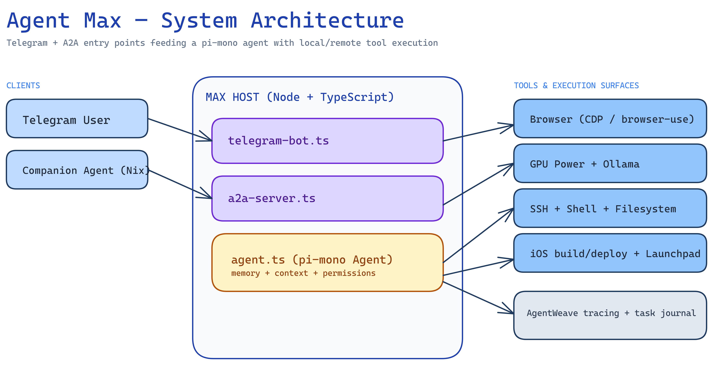
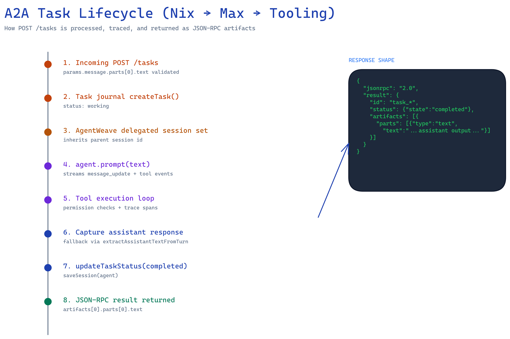
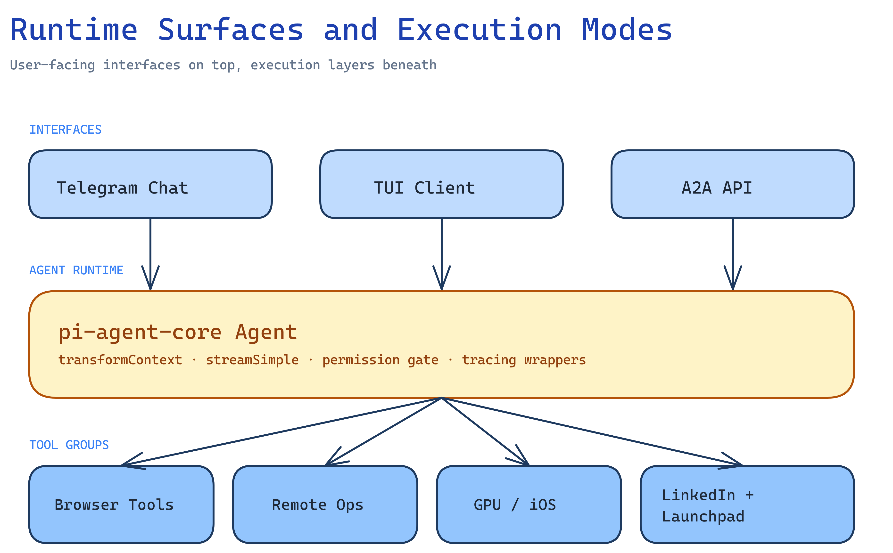

# Agent Max

Self-hosted AI agent. Opinionated fork of [pi-mono](https://github.com/nicememe-studio/pi-mono) with A2A, browser automation, and distributed compute.

## Philosophy

Agent state (plans, todos, memory) lives in plain markdown files, not structured tools or hooks. The agent reads and writes `.md` files directly. No JSON state machines, no tool-call interception, no confirmation flows. Keep it light.

## Architecture

Max communicates with companion agents via A2A (Agent-to-Agent) protocol. Users interact through Telegram.

### 1) System architecture



### 2) A2A task lifecycle (Nix -> Max)



### 3) Runtime surfaces and execution modes



Source files for all diagrams are in `docs/diagrams/` as both `.excalidraw` and `.png`.

## Tools

| Tool | Description |
|------|-------------|
| `browser_control` | Chrome automation via CDP |
| `browser_task` | Agentic browser tasks (browser-use) |
| `wake_gpu` / `shutdown_gpu` / `gpu_status` | GPU PC power management (WoL + Ollama) |
| `ssh_to_nas` | Run commands on remote hosts via SSH |
| `delegate_to_nix` | Send tasks to companion agents via A2A |
| `read_file` / `write_file` / `list_files` | Local filesystem operations |
| `run_shell` | Execute shell commands |
| `linkedin_search` / `linkedin_results` | LinkedIn scraping |
| `launchpad_run_scraper` / `launchpad_deploy` / `launchpad_scrape` | Launchpad automation |
| `ios_list_devices` / `ios_build` / `ios_install` | iOS build and deploy |
| `context_info` | Agent context and state info |

## Setup

```bash
git clone <repo-url> && cd agent-max
cp .env.example .env
# Fill in your API keys and config in .env
npm install
npm run build
npm start
```

### Environment Variables

See `.env.example` for the full list. Key variables:

- `GOOGLE_API_KEY` / `ANTHROPIC_API_KEY` - LLM provider keys
- `TELEGRAM_BOT_TOKEN` / `TELEGRAM_ALLOWED_USERS` - Telegram bot config
- `A2A_PORT` - A2A server port (default: 8770)
- `A2A_SHARED_SECRET` - Shared secret for A2A auth between agents
- `NIX_A2A_URL` - URL of companion agent
- `NAS_HOST` / `NAS_USER` - NAS SSH access
- `GPU_HOST` / `GPU_WOL_URL` / `GPU_SHUTDOWN_TOKEN` - GPU PC management
- `MAX_A2A_URL` - Public URL for this agent's A2A card

### Development

```bash
npm run dev   # Watch mode with tsx + nodemon
npm run tui   # Interactive TUI client
```

## A2A Protocol

Max exposes an A2A server for receiving tasks from other agents:

- `GET /.well-known/agent.json` - Agent card (public)
- `GET /health` - Health check (public)
- `POST /tasks` - Submit a task (auth required)
- `POST /tasks/stream` - Submit with SSE streaming (auth required)
- `GET /tasks/:id` - Query task status (auth required)

Auth uses `Authorization: Bearer <A2A_SHARED_SECRET>`.
